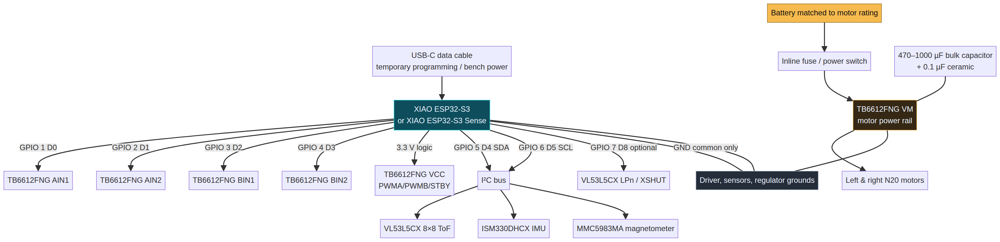

# DeskBot-S3 Wiring and staged circuit plan

## Stage 1 — controller only

1. Connect the XIAO ESP32-S3/Sense through a **data-capable USB-C cable**.
2. Flash `deskbot-s3-base-v0.1.0.factory.bin` from the DeskBot Flash Lab site.
3. Join `DeskBot-S3-Setup` / `deskbot-s3`, then open `http://192.168.4.1`.
4. Enter location-specific Wi-Fi. The board restarts and reconnects independently; open the displayed IP address or `http://deskbot-s3.local` on compatible networks.

## Stage 2 — motor driver

Use a TB6612FNG rather than an L298N for small N20 motors. It wastes less battery voltage and accepts 3.3 V logic.

- XIAO 3V3 → TB6612 VCC, PWMA, PWMB, STBY (logic only).
- XIAO D0/D1 → AIN1/AIN2; XIAO D2/D3 → BIN1/BIN2.
- Separate motor battery/regulator → TB6612 VM; battery negative → common GND.
- Put 470–1000 µF electrolytic + 0.1 µF ceramic across VM/GND at the TB6612 board.
- Raise wheels from the surface, use the local dashboard to arm motor outputs, and test at low PWM.

## Stage 3 — sensors

- XIAO D4/GPIO5 → SDA for all sensors.
- XIAO D5/GPIO6 → SCL for all sensors.
- XIAO D8/GPIO7 → VL53L5CX LPn/XSHUT if the breakout exposes it.
- Keep sensor bus at 3.3 V. Run the I²C scanner after adding **one** module at a time.

## Stage 4 — optional Sense camera

The factory image automatically tries the official XIAO ESP32-S3 Sense OV2640 pin map. The local dashboard will report whether the camera is ready and can capture a single test frame.

> Do not combine USB programming and an unplanned battery connection. The early bench setup should run from USB only; the later mobile setup needs a deliberate regulator / switch / fuse design.
